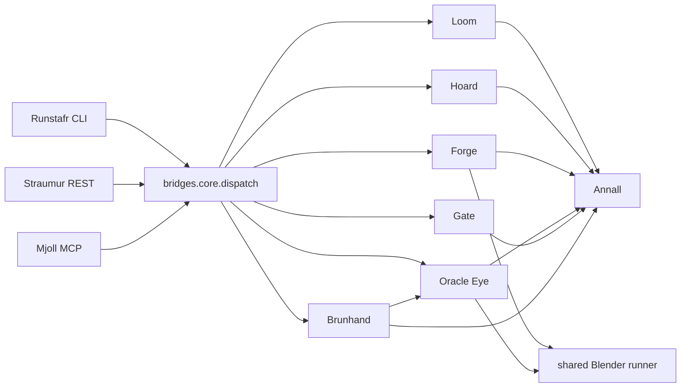
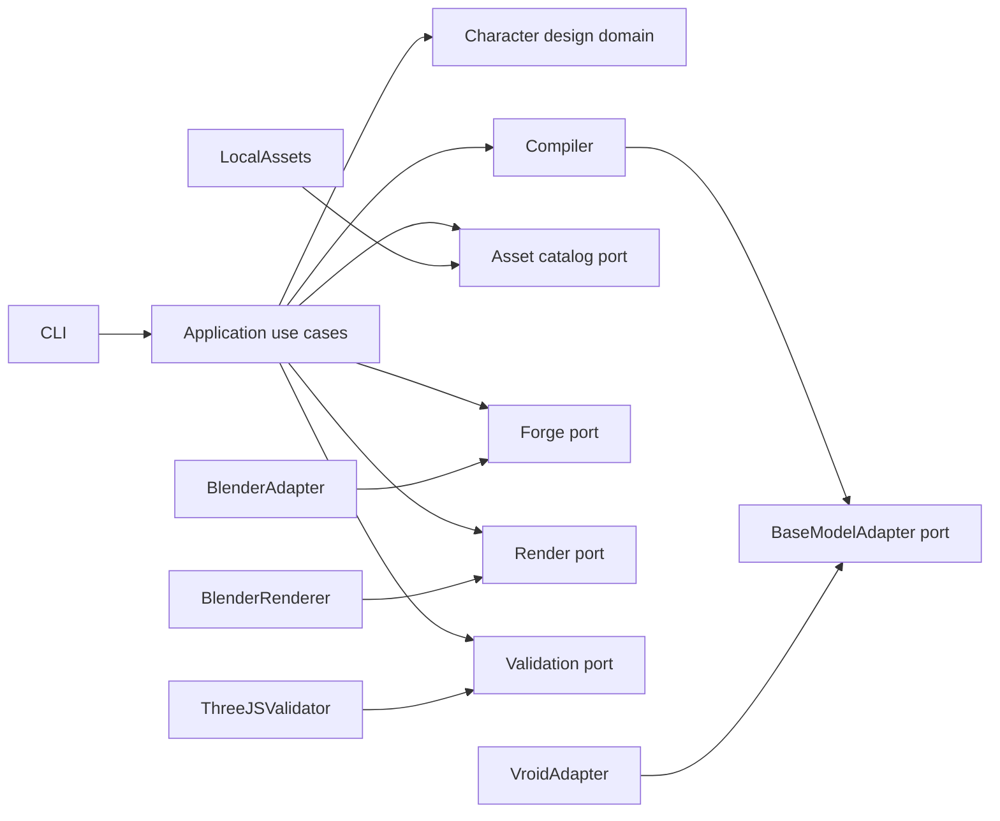

# Dependency Map

## Observed Build Flow



The first five Core arrows form the useful product path. REST, MCP, and
Brúarhönd are lateral interfaces or features. Annáll is cross-cutting and creates
migration coupling despite having a port.

## Domain-Level Import Edges

The following edges were observed by parsing all 62 source files. Counts are
import occurrences, not runtime call counts.

| Source | Target | Import occurrences | Interpretation |
|---|---|---:|---|
| bridges | config | 14 | Every transport/config path resolves project settings directly. |
| bridges | brunhand | 12 | Core and CLI are coupled to remote GUI operations. |
| bridges | annall | 8 | Transports construct or use telemetry. |
| bridges | hoard | 6 | CLI/REST expose asset operations directly. |
| bridges | gate | 5 | Inspect paths bypass full dispatch by design. |
| bridges | loom | 4 | CLI/MCP pre-read or validate specs. |
| bridges | forge | 1 | Core build orchestration. |
| bridges | oracle_eye | 1 | Core rendering orchestration. |
| brunhand | annall | 11 | Remote GUI sessions are deeply instrumented. |
| brunhand | config | 3 | Daemon/client configuration. |
| brunhand | oracle_eye | 1 | External screenshot registration. |
| forge | shared runner | 2 | Strong subprocess seam. |
| forge | loom | 1 | Forge accepts domain `AvatarSpec` directly. |
| forge | annall | 1 | Build-stage telemetry. |
| oracle_eye | shared runner | 1 | Strong subprocess seam. |
| oracle_eye | annall | 1 | Render-stage telemetry. |
| loom | annall | 2 | Validation emits events. |
| hoard | annall | 3 | Resolution/bootstrap emits events. |
| hoard | config | 1 | Catalog/path resolution. |
| gate | annall | 1 | Compliance emits events. |

## Actual Core Dependencies

`bridges/core/dispatch.py` imports or constructs:

- `AnnallPort`;
- config/path helpers;
- Loom loader and semantic validator;
- local Hoard adapter;
- Forge build runner;
- Oracle Eye renderer;
- Gate and report types;
- Brúarhönd client factory and exceptions.

This means deleting Brúarhönd before splitting Core will break the supposedly
canonical build module even when the normal build path does not use remote GUI
automation.

## Strong Reuse Seams

### Shared Blender subprocess runner

`_internal/blender_runner.py` isolates executable resolution, process creation,
timeouts, termination, output capture, and script arguments. Forge and Oracle Eye
already share it without importing `bpy` into application code.

**Migration action:** characterize, move, rename, and keep its interface narrow.

### Hoard port

`HoardPort` separates resolution/listing behavior from the local catalog adapter.

**Migration action:** preserve the port idea, but change metadata to require
provenance and checksum fields.

### Annáll port and Null adapter

Although Annáll is overused, the port permits a temporary Null adapter while
other modules migrate.

**Migration action:** use Null during transition; replace durable session history
with explicit build reports before deleting adapters.

### Structured Gate reports

Gate reports return data instead of throwing for ordinary policy violations.

**Migration action:** preserve this behavior for Three.js/web validation.

## Weak Or Missing Seams

### Monolithic Blender builder

`forge/scripts/build_avatar.py` is 1,462 lines and embeds:

- base import dispatch;
- material classification and pixel transformations;
- global TurboSquid bone mapping;
- global TurboSquid expression mapping;
- VRM metadata and first-person setup;
- look-at setup;
- export and post-export checks.

A base-model adapter boundary is absent. This is the principal change point for
the new compiler.

### Schema-to-builder contract

Forge imports `AvatarSpec` directly, but the builder receives serialized JSON and
silently ignores many schema fields. There is no compiled, capability-checked
intermediate representation.

**Required seam:** `CharacterDesignPackage -> BaseModelAdapter ->
CompiledCharacterSpec -> BlenderForge`.

### Transport leakage

CLI, REST, and MCP directly call Gate, Hoard, Config, Annáll, and Loom for
standalone operations. Not every action flows through one application service.

**Required seam:** narrow application use cases (`build`, `inspect`, `list
assets`, `validate design`) with thin transport adapters.

## External Dependency Inventory

### Declared base dependencies

```text
pydantic
pyyaml
click
fastapi
uvicorn[standard]
mcp
httpx
```

### Declared optional groups

```text
dev: pytest, pytest-asyncio, pytest-cov, ruff, mypy, respx
brunhand-daemon: pyautogui, mss, pygetwindow
brunhand-win: pywinauto
brunhand-mac: pyobjc-framework-Quartz
brunhand-linux: pyatspi
```

### Imports supplied implicitly, transitively, or by Blender/runtime

| Import | Observed use | Concern |
|---|---|---|
| `bpy`, `addon_utils`, `io_scene_vrm` | Forge/render scripts | Must be provided by Blender and installed add-on, not normal Python. |
| `numpy` | Texture manipulation in Blender scripts | Assumed available in Blender environment; contract is implicit. |
| `PIL` | Texture script and GUI screenshot runtime | Not declared directly. |
| `psutil` | Brúarhönd runtime | Not declared directly. |
| `pyperclip` | Brúarhönd runtime | Not declared directly. |
| `starlette` | REST/daemon middleware and test client | Transitive through FastAPI. |
| `mss`, `pyautogui`, `pygetwindow` | Remote GUI runtime | Correctly associated with Brúarhönd extras, but imports can still touch headless environments. |

The future package should keep core CLI dependencies minimal and represent
Blender-side requirements explicitly in environment verification.

## Source-Of-Truth Decisions

| Knowledge | Current duplication | Future source of truth |
|---|---|---|
| Character identity/proportions | Loom spec, builder hardcodes, base mesh | `CharacterDesignPackage` |
| Base capabilities | Catalog metadata, code assumptions, hardcoded maps | Versioned `BaseModelAdapter` manifest |
| Operations sent to Blender | Raw spec plus builder conditionals | `CompiledCharacterSpec` |
| Expression names | known-blendshape YAML, Gate rules, builder map | Versioned avatar runtime expression contract |
| Build result | bridge-specific JSON plus Annáll | Build manifest and typed report |
| Compliance | VRChat/VTube rules plus post-export checks | Target profiles with Three.js/web as primary |
| Asset licensing | catalog fields, root license, prose | Per-asset provenance manifest |

## Target Dependency Direction



Domain and application modules must not import Blender, FastAPI, MCP, GUI
automation, or Three.js implementation details.

## Migration Constraints

1. Preserve current Blender runner behavior before moving it (`WELC-01`).
2. Introduce one explicit adapter/compiler seam before modifying base-specific
   transformations (`WELC-02`).
3. Keep any temporary compatibility wrapper documented with a deletion trigger
   (`WELC-03`).
4. Do not maintain both Loom and CharacterDesignPackage as coequal sources of
   truth (`TPP-01`).
5. Keep each cutover reversible until the new CLI produces a validated fixture
   (`TPP-02`).
6. Add focused diagnostics at every migrated boundary (`TPP-03`).
